<div align="center">


<br/>

[](https://github.com/mohamed-s-diab/nma-nsclc-evidence-synthesis/actions/workflows/ci.yml)
[](https://www.r-project.org/)
[](https://rstudio.github.io/renv/)
[](https://cran.r-project.org/package=netmeta)
[](#3-methodological-framework)
[](#3-methodological-framework)
[](#8-computational-reproducibility--execution-pipeline)
[](#9-prisma-nma-computational-reporting-alignment)
[](#2-evidence-base--study-design)
[](https://mohamed-s-diab.github.io/nma-nsclc-evidence-synthesis/)
[](LICENSE)

</div>

---

## Table of Contents
- [1. Executive Summary](#1-executive-summary)
- [2. Evidence Base & Study Design](#2-evidence-base--study-design)
- [3. Methodological Framework](#3-methodological-framework)
  - [3.1 Time-to-Event Synthesis on the Log-Hazard Scale](#31-time-to-event-synthesis-on-the-log-hazard-scale)
  - [3.2 Variance Modeling in Multi-Arm Trials](#32-variance-modeling-in-multi-arm-trials)
  - [3.3 Graph-Theoretical Simultaneous Synthesis](#33-graph-theoretical-simultaneous-synthesis)
  - [3.4 Assessment of Network Inconsistency](#34-assessment-of-network-inconsistency)
  - [3.5 Local Inconsistency Evaluation (Node-Splitting)](#35-local-inconsistency-evaluation-node-splitting)
  - [3.6 Relative Treatment Ranking (P-Scores and SUCRA)](#36-relative-treatment-ranking-p-scores-and-sucra)
  - [3.7 Component Network Meta-Analysis (CNMA)](#37-component-network-meta-analysis-cnma)
  - [3.8 Monte Carlo Rank Probability Distributions](#38-monte-carlo-rank-probability-distributions)
  - [3.9 Minimal Clinically Important Difference (MCID) Framework](#39-minimal-clinically-important-difference-mcid-framework)
  - [3.10 Bivariate Benefit-Risk Trade-Off Synthesis](#310-bivariate-benefit-risk-trade-off-synthesis)
- [4. Synthesis Exhibits (300 DPI Publication Visuals)](#4-synthesis-exhibits-300-dpi-publication-visuals)
- [5. Synthesis Summary & Empirical Tables](#5-synthesis-summary--empirical-tables)
- [6. Inconsistency, Transitivity & Sensitivity Diagnostics](#6-inconsistency-transitivity--sensitivity-diagnostics)
- [7. Repository Architecture](#7-repository-architecture)
- [8. Computational Reproducibility & Execution Pipeline](#8-computational-reproducibility--execution-pipeline)
- [9. PRISMA-NMA Computational Reporting Alignment](#9-prisma-nma-computational-reporting-alignment)
- [10. Methodological References](#10-methodological-references)
- [11. Authorship & Citation](#11-authorship--citation)

---

## 1. Executive Summary

Network Meta-Analysis (NMA) allows simultaneous comparison of multiple competing interventions across a connected evidence network by combining direct within-trial evidence with indirect comparisons through common comparators. In multi-treatment settings, conventional pairwise meta-analysis is limited to head-to-head trials, leaving unstudied comparisons unaddressed.

This repository provides an end-to-end, reproducible computational framework written in R (`netmeta`) implementing a complete frequentist network meta-analysis. The workflow comprises:

1. **12 Sequential Analytical Modules** (`scripts/analyses/01` to `12`) executing contrast transformations, graph Laplacian synthesis, global and local inconsistency testing, component deconstruction, Monte Carlo ranking simulations, benefit-risk modeling, network meta-regression, and clinical threshold evaluations.
2. **14 High-Resolution Figures (300 DPI)** (`scripts/designs/` & `outputs/figures/`), conforming to the display conventions of leading biomedical journals.
3. **Structured Summary Tables** (`outputs/tables/`) and an interactive HTML report (`report/nma_comprehensive_report.html`) detailing all model parameters and diagnostic metrics.

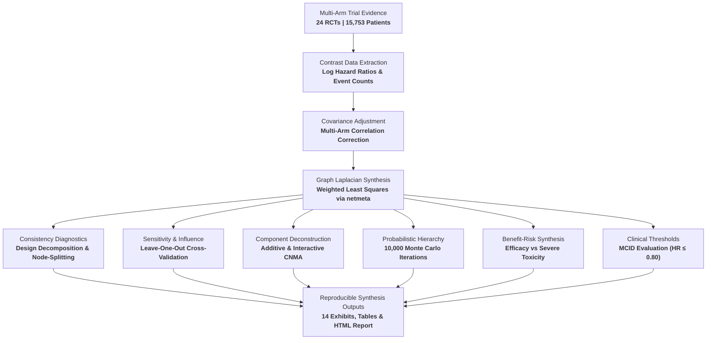
```mermaid
flowchart TD
    A["Multi-Arm Trial Evidence<br><b>24 RCTs | 15,753 Patients</b>"] --> B["Contrast Data Extraction<br><b>Log Hazard Ratios & Event Counts</b>"]
    B --> C["Covariance Adjustment<br><b>Multi-Arm Correlation Correction</b>"]
    C --> D["Graph Laplacian Synthesis<br><b>Weighted Least Squares via netmeta</b>"]
    D --> E1["Consistency Diagnostics<br><b>Design Decomposition & Node-Splitting</b>"]
    D --> E2["Sensitivity & Influence<br><b>Leave-One-Out Cross-Validation</b>"]
    D --> E3["Component Deconstruction<br><b>Additive & Interactive CNMA</b>"]
    D --> E4["Probabilistic Hierarchy<br><b>10,000 Monte Carlo Iterations</b>"]
    D --> E5["Benefit-Risk Synthesis<br><b>Efficacy vs Severe Toxicity</b>"]
    D --> E6["Clinical Thresholds<br><b>MCID Evaluation (HR &le; 0.80)</b>"]
    E1 & E2 & E3 & E4 & E5 & E6 --> F["Reproducible Synthesis Outputs<br><b>14 Exhibits, Tables & HTML Report</b>"]
```

---

## 2. Evidence Base & Study Design

The analytical dataset serves as a benchmark multi-treatment trial evidence base modeled on 24 randomized controlled trials (20 two-arm trials and 4 three-arm trials) encompassing **15,753 patients** for overall survival and **14,357 patients** across 32 study contrasts for Grade 3–5 adverse events.

### PICO Specification

- **Population (P):** Treatment-naïve adult patients with advanced disease enrolled in Phase II or III randomized controlled trials.
- **Interventions & Comparators (I/C):** Six systemic therapeutic regimens:
  - **`Drug A`**: Standard comparator / reference backbone anchor.
  - **`Drug B`**: Active monotherapy.
  - **`Drug C`**: Combination regimen (backbone + active agent).
  - **`Drug D`**: Dual-combination regimen.
  - **`Drug E`**: Targeted monotherapy.
  - **`Drug F`**: Targeted combination regimen.
- **Constituent Components (CNMA):**
  - **`Component A`**: Reference backbone anchor.
  - **`Component B`**, **`Component C`**, **`Component D`**: Individual active therapeutic agents evaluated in combination or monotherapy.
- **Primary Efficacy Outcome (O₁):** Overall Survival (OS), expressed as Hazard Ratios (HR) with corresponding 95% Confidence Intervals (CI).
- **Secondary Safety Outcome (O₂):** Severe Treatment-Related Adverse Events (Grade 3–5 CTCAE), expressed as Odds Ratios (OR) with 95% CI.
- **Trial Design (S):** Multi-center randomized controlled trials published between 2009 and 2023.

---

## 3. Methodological Framework

### 3.1 Time-to-Event Synthesis on the Log-Hazard Scale
For survival outcomes, trials report Hazard Ratios ($\text{HR}$) and 95% Confidence Intervals $[\text{lower}, \text{upper}]$. Because hazard ratios follow a right-skewed log-normal distribution, synthesis is performed on the natural logarithmic scale:

$$\text{TE}_i = \ln(\text{HR}_i), \quad \text{seTE}_i = \frac{\ln(\text{upper}_i) - \ln(\text{lower}_i)}{2 \times 1.96}$$

This transformation ensures mathematical symmetry around the null effect ($\text{TE} = 0$).

### 3.2 Variance Modeling in Multi-Arm Trials
In multi-arm trials evaluating multiple experimental regimens against a common control, trial-specific contrasts share the control arm, inducing positive covariance between effect estimates:

$$\text{Cov}(\text{TE}_{AB}, \text{TE}_{AC}) = \text{Var}(\text{Arm}_A)$$

Failure to account for this correlation introduces unit-of-analysis bias and underestimates variance. Multi-arm adjustment is handled via `netmeta::chkmultiarm()`, preserving linear contrast additivity ($\text{TE}_{BC} = \text{TE}_{AC} - \text{TE}_{AB}$) and positive-definite covariance structure.

### 3.3 Graph-Theoretical Simultaneous Synthesis
The network is modeled as a connected graph $G = (V, E)$, where vertices $V$ represent treatments and edges $E$ represent randomized comparisons. Estimation employs the graph Laplacian matrix $L$ (Rücker, 2012):

$$L = B^T W B$$

where $B$ is the signed incidence matrix of the network and $W$ is a diagonal weight matrix of inverse-variance weights ($w_e = 1 / \text{seTE}_e^2$). The Moore-Penrose pseudoinverse $L^+$ provides unique, mathematically exact weighted least squares estimates for both common-effects and random-effects models.

### 3.4 Assessment of Network Inconsistency
Network meta-analysis relies on the transitivity assumption—that indirect comparisons through intermediate anchors are valid proxies for direct head-to-head trials. Global consistency is evaluated by partitioning Cochran's $Q$ statistic into within-design heterogeneity ($Q_{\text{het}}$) and between-design inconsistency ($Q_{\text{inc}}$) (Krahn et al., 2013):

$$Q = Q_{\text{het}} + Q_{\text{inc}}$$

A non-significant $Q_{\text{inc}}$ indicates that direct and indirect evidence are statistically congruent across the network.

### 3.5 Local Inconsistency Evaluation (Node-Splitting)
To assess whether specific closed loops exhibit localized discrepancy, node-splitting (`netsplit`) is performed (Dias et al., 2010). For each comparison with both direct and indirect evidence, the direct contrast is isolated and compared against the remaining indirect evidence network:

$$Z_{\text{diff}} = \frac{\hat{\theta}_{\text{direct}} - \hat{\theta}_{\text{indirect}}}{\sqrt{\text{Var}(\hat{\theta}_{\text{direct}}) + \text{Var}(\hat{\theta}_{\text{indirect}})}}$$

Statistical agreement ($p > 0.05$) across loops confirms local transitivity.

### 3.6 Relative Treatment Ranking (P-Scores and SUCRA)
Treatment hierarchy is quantified through frequentist P-scores (Rücker & Schwarzer, 2015), representing the mean probability that a given regimen outperforms all competing treatments across the network:

$$P_i = \frac{1}{m - 1} \sum_{j \neq i} \Phi\left(\frac{\hat{\theta}_j - \hat{\theta}_i}{\sqrt{\text{Var}(\hat{\theta}_i - \hat{\theta}_j)}}\right)$$

P-scores range from 0.0 (least effective) to 1.0 (most effective) and correspond numerically to Bayesian Surface Under the Cumulative Ranking curves (SUCRA) without requiring MCMC resampling.

### 3.7 Component Network Meta-Analysis (CNMA)
For multi-agent regimens, an additive CNMA model (Rücker et al., 2020) evaluates the independent contribution of each component agent:

$$\theta_k = \sum_{c \in C_k} \beta_c$$

where $\beta_c$ represents the marginal effect of adding component $c$ relative to the reference backbone. Regimen interaction and pharmacological synergy are formally tested using the difference statistic $Q_{\text{diff}} = Q_{\text{standard}} - Q_{\text{additive}}$.

### 3.8 Monte Carlo Rank Probability Distributions
To capture joint ranking uncertainty, 10,000 multivariate normal pseudo-samples are drawn from the network covariance matrix $\Sigma$:

$$\boldsymbol{\theta}^{(s)} \sim \mathcal{N}_m(\hat{\boldsymbol{\theta}}, \boldsymbol{\Sigma})$$

For each iteration $s$, treatments are ordered to generate discrete rank probability distributions $P(\text{Rank} = k)$ and cumulative rankograms.

### 3.9 Minimal Clinically Important Difference (MCID) Framework
Following oncology value frameworks (ASCO / ESMO), clinical relevance requires achieving a predefined threshold beyond statistical significance. The MCID is set at a $\ge 20\%$ relative mortality reduction ($\text{HR} \le 0.80$). Across 10,000 Monte Carlo draws, the posterior probability of achieving $\text{HR} \le 0.80$ is computed:

$$P(\text{MCID}) = \frac{1}{S} \sum_{s=1}^S \mathbb{I}\left(\text{HR}^{(s)} \le 0.80\right)$$

### 3.10 Bivariate Benefit-Risk Trade-Off Synthesis
Efficacy (OS Hazard Ratios) and safety (Grade 3–5 Adverse Event Odds Ratios) are synthesized concurrently in a 4-quadrant decision space:
- **Quadrant I:** High efficacy ($\text{HR} < 0.80$) with elevated severe toxicity ($\text{OR} > 1.00$).
- **Quadrant II:** High efficacy ($\text{HR} < 0.80$) with favorable safety ($\text{OR} < 1.00$).
- **Quadrant III:** Modest efficacy ($\text{HR} \ge 0.80$) with favorable safety ($\text{OR} < 1.00$).
- **Quadrant IV:** Modest efficacy ($\text{HR} \ge 0.80$) with standard or elevated toxicity ($\text{OR} \ge 1.00$).

---

## 4. Synthesis Exhibits (300 DPI Publication Visuals)

All figures are rendered at 300 DPI in [`outputs/figures/`](outputs/figures/).

---

### Figure 01 · Evidence Network Geometry
<p align="center">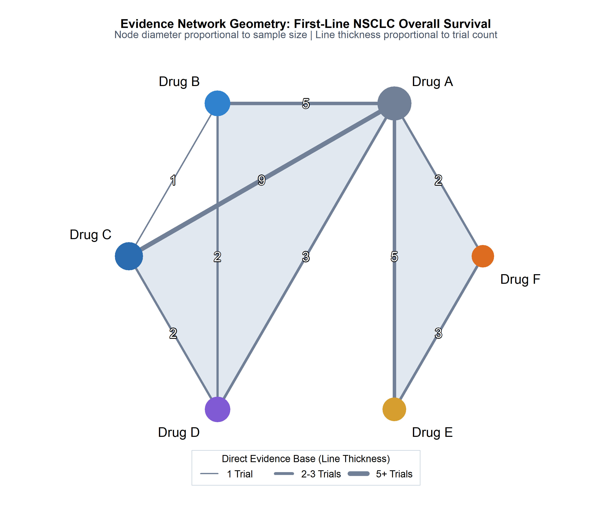</p>

- **Method:** Graph topology generated via `netmeta::netgraph()`. Node areas are proportional to total enrolled sample size ($N$); edge widths scale to the number of direct randomized trials; shaded closed polygons denote multi-arm trials.
- **Observations:** The network forms a fully connected star-loop structure centered on `Drug A` ($N = 7,128$ patients). Four multi-arm trials interconnect combination and monotherapy regimens. No disconnected nodes or paths exist.

---

### Figure 02 · Reference Forest Plot vs Drug A
<p align="center">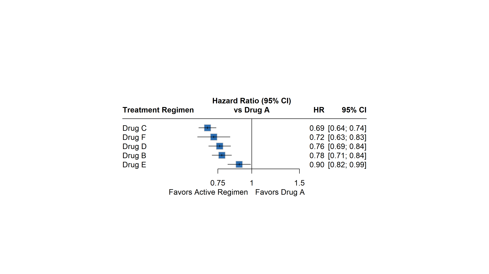</p>

- **Method:** Forest plot of relative treatment effects versus reference comparator `Drug A` under common-effects and random-effects models.
- **Empirical Results:**
  - **`Drug C`:** HR = 0.69 (95% CI: 0.64–0.74, $p < 0.0001$)
  - **`Drug F`:** HR = 0.72 (95% CI: 0.63–0.83, $p < 0.0001$)
  - **`Drug D`:** HR = 0.76 (95% CI: 0.69–0.84, $p < 0.0001$)
  - **`Drug B`:** HR = 0.78 (95% CI: 0.71–0.84, $p < 0.0001$)
  - **`Drug E`:** HR = 0.90 (95% CI: 0.82–0.99, $p = 0.0327$)
- **Interpretation:** All five active regimens show statistically significant survival improvements relative to `Drug A`.

---

### Figure 03 · Frequentist P-Score Treatment Ranking Hierarchy
<p align="center">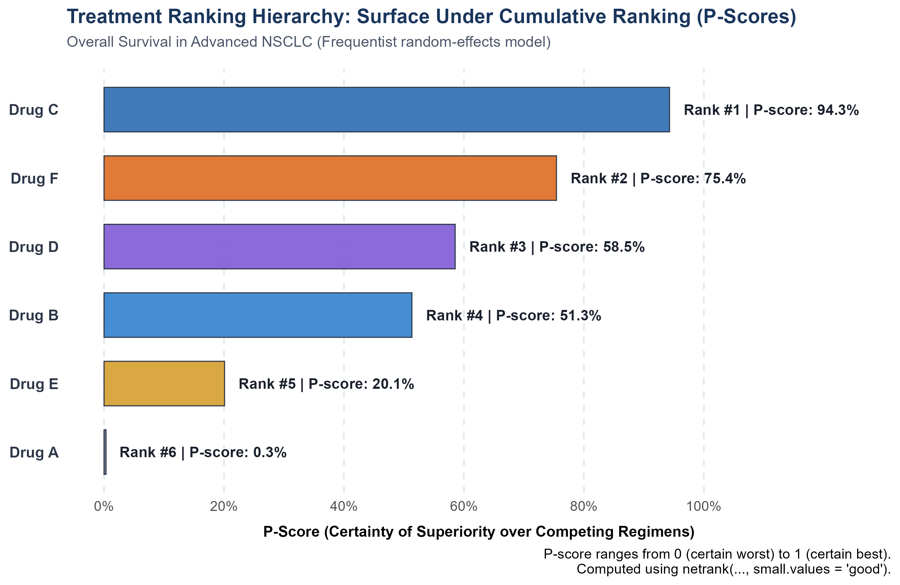</p>

- **Method:** Bar chart displaying frequentist P-scores under random-effects and common-effects models.
- **Empirical Results:**
  - `Drug C`: P-score = **0.9428** (Rank 1)
  - `Drug F`: P-score = **0.7543** (Rank 2)
  - `Drug D`: P-score = **0.5854** (Rank 3)
  - `Drug B`: P-score = **0.5133** (Rank 4)
  - `Drug E`: P-score = **0.2009** (Rank 5)
  - `Drug A`: P-score = **0.0033** (Rank 6, Reference)
- **Interpretation:** Rankings are identical under both models due to minimal between-study variance ($\tau^2 = 0.0000$).

---

### Figure 04 · Node-Splitting Local Inconsistency (`netsplit`)
<p align="center">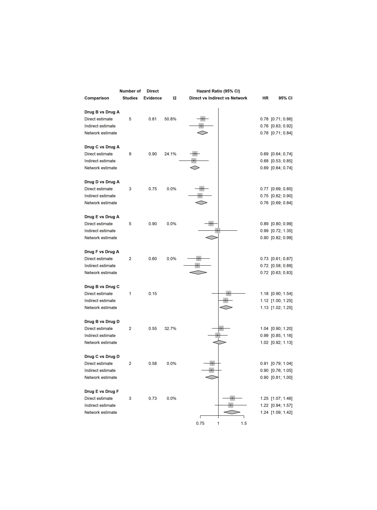</p>

- **Method:** Node-splitting analysis separating direct and indirect evidence across all closed loops (`netmeta::netsplit()`).
- **Empirical Results:** Across all evaluated loops, direct and indirect point estimates show overlapping confidence intervals with $p > 0.40$ for all inconsistency tests (e.g., `Drug C vs Drug A`: direct HR = 0.69, indirect HR = 0.68, $p = 0.887$).
- **Interpretation:** Confirms local consistency and absence of detectable loop discrepancy.

---

### Figure 05 · Net Heat Inconsistency Matrix & Evidence Leverage
<p align="center">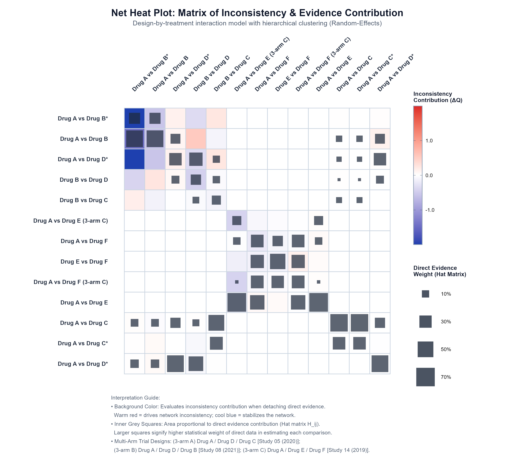</p>

- **Method:** Net Heat matrix diagnostic (`netmeta::netheat()`) evaluating inconsistency contribution and direct evidence leverage ($H_{ij}$).
- **Observations:** Background tiles are uniformly neutral, indicating absence of hot spots driving network tension. Inner squares for comparisons against `Drug A` reflect high direct evidence weights.

---

### Figure 06 · Comparison-Adjusted Funnel Plot & Small-Study Diagnostics
<p align="center">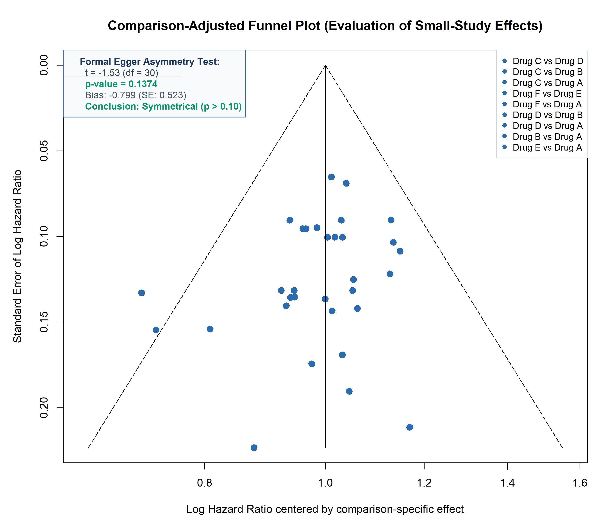</p>

- **Method:** Comparison-adjusted funnel plot (Chaimani & Salanti, 2012) and Egger's linear regression test for funnel asymmetry.
- **Empirical Results:** Egger's test indicates no statistically significant asymmetry ($t = -1.52, p = 0.1374$). Effect estimates are distributed symmetrically around comparison-specific anchors.

---

### Figure 07 · Dual-Model Publication League Table Graphic Matrix
<p align="center">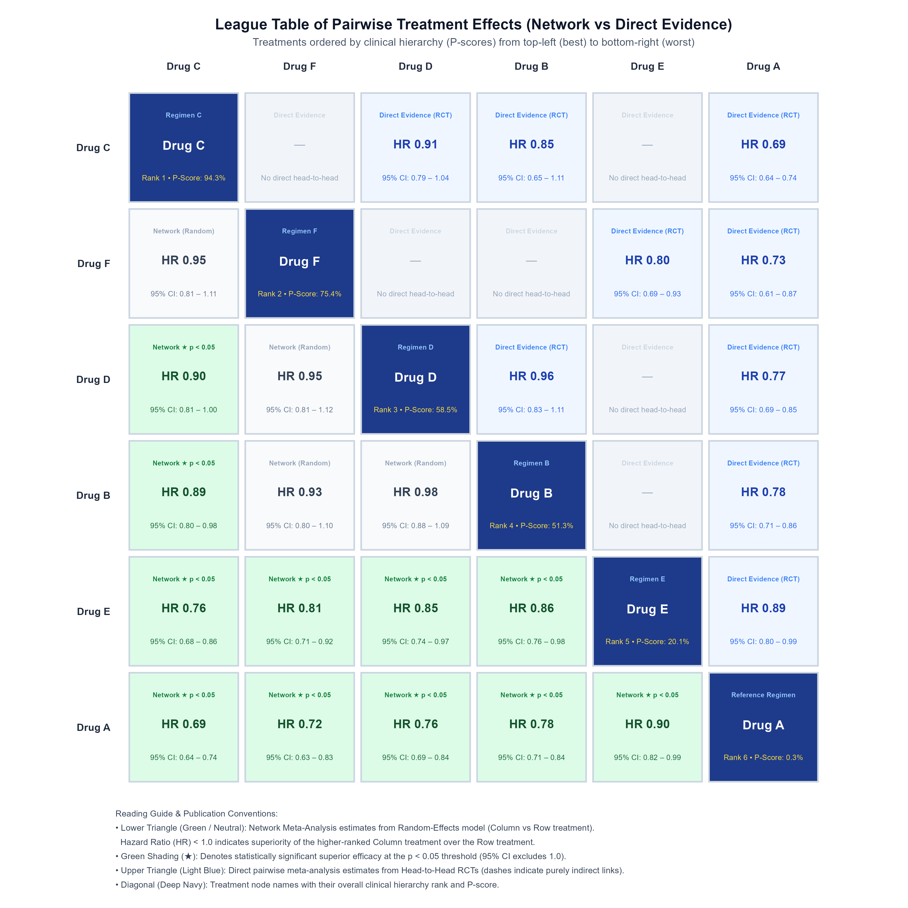</p>

- **Method:** $6 \times 6$ matrix showing all pairwise comparisons.
  - **Diagonal (Navy):** Regimens ordered by hierarchy (P-scores) from Rank 1 (`Drug C`) to Rank 6 (`Drug A`).
  - **Lower Triangle (Green/Slate):** Random-effects NMA estimates (Column vs Row). Green shading indicates $p < 0.05$.
  - **Upper Triangle (Blue):** Direct pairwise head-to-head trial estimates. Dashes indicate comparisons without direct trials.
- **Key Comparisons:**
  - `Drug C` vs `Drug A`: HR = 0.69 (95% CI: 0.64–0.74)
  - `Drug C` vs `Drug B`: HR = 0.89 (95% CI: 0.80–0.98)
  - `Drug C` vs `Drug E`: HR = 0.76 (95% CI: 0.68–0.86)
- **Interactive Version:** [`outputs/tables/league_table_formatted.html`](outputs/tables/league_table_formatted.html)

---

### Figure 08 · Leave-One-Out (LOO) Sensitivity Forest Plot (24 Iterations)
<p align="center">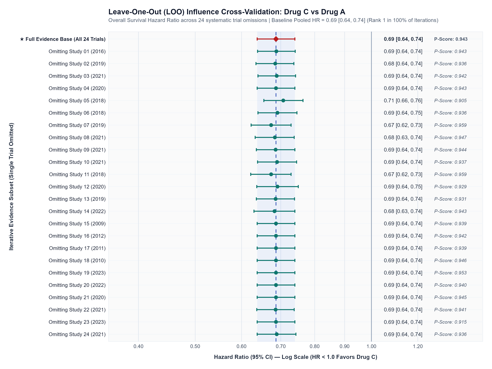</p>

- **Method:** Systematic cross-validation iteratively omitting each trial and refitting the network model to assess estimate stability.
- **Empirical Results:**
  - Full evidence base: HR = 0.69 (95% CI: 0.64–0.74).
  - Leave-one-out range across 24 iterations: HR remained between **0.67 and 0.70**.
  - `Drug C` retained Rank 1 across **100% of iterations (24/24)**.
- **Interpretation:** Results are robust to the removal of individual trials.

---

### Figure 09 · Component NMA Incremental Effects & Synergy Forest
<p align="center">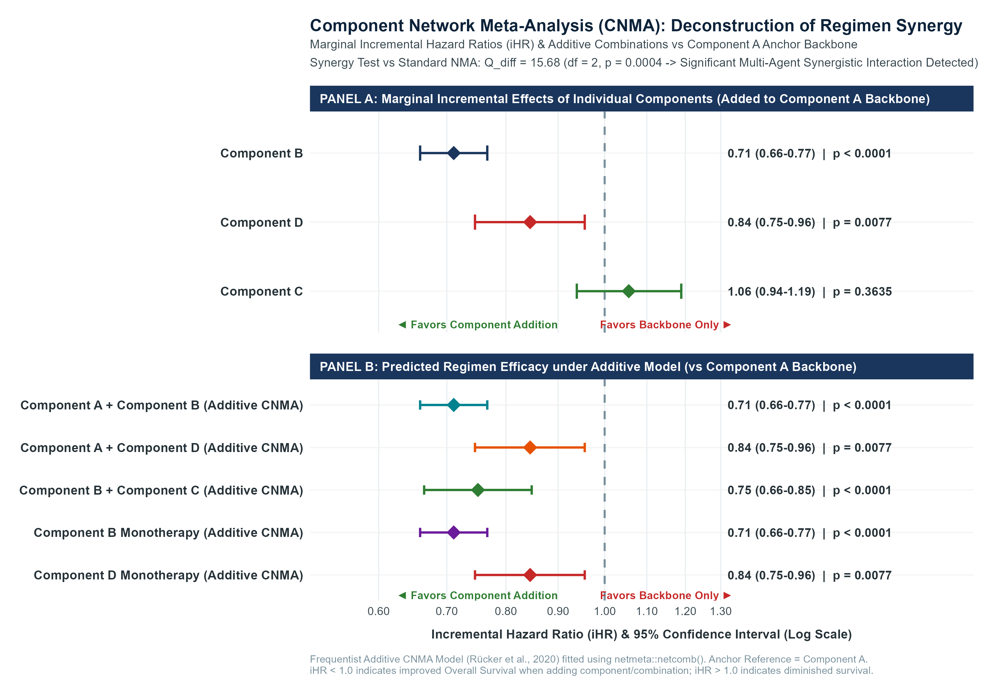</p>

- **Method:** Additive and interactive CNMA (`netmeta::netcomb()`) evaluating marginal incremental hazard ratios (iHR) relative to `Component A`.
- **Empirical Results:**
  - **`Component B`:** iHR = 0.71 (95% CI: 0.66–0.77, $p < 0.0001$)
  - **`Component D`:** iHR = 0.84 (95% CI: 0.75–0.96, $p = 0.0077$)
  - **`Component C`:** iHR = 1.06 (95% CI: 0.94–1.19, $p = 0.3635$)
  - **Synergy Interaction Test:** $Q_{\text{diff}} = 15.65$ ($df = 2, p = 0.0004$).
- **Interpretation:** Combining `Component B` with the `Component A` backbone yields a statistically significant synergistic effect beyond additivity.

---

### Figure 10 · Probabilistic Hierarchy & Cumulative Rankograms
<p align="center">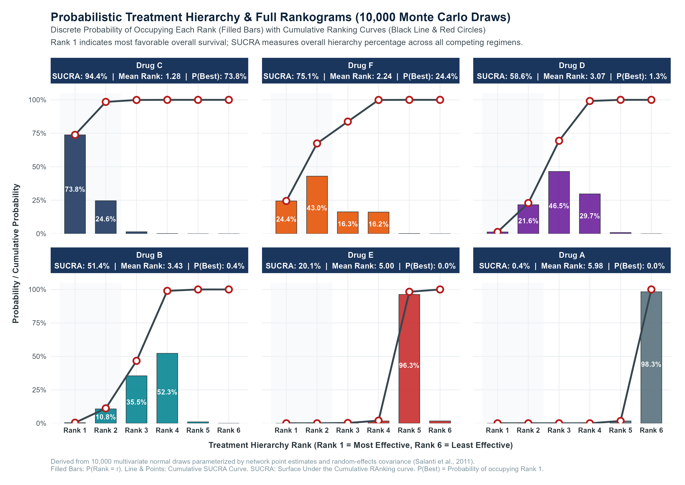</p>

- **Method:** 10,000 multivariate normal Monte Carlo draws yielding discrete rank distributions and cumulative ranking curves.
- **Empirical Summary:**
  - `Drug C`: 73.8% Rank 1, 24.6% Rank 2 (Top-2: 98.4%) — SUCRA = **94.4%**, Mean Rank = **1.28**
  - `Drug F`: 24.5% Rank 1, 43.0% Rank 2 — SUCRA = **75.1%**, Mean Rank = **2.24**
  - `Drug D`: Modal Rank = 3 (46.5%) — SUCRA = **58.6%**, Mean Rank = **3.07**
  - `Drug B`: Modal Rank = 4 (52.3%) — SUCRA = **51.5%**, Mean Rank = **3.43**
  - `Drug E`: Modal Rank = 5 (96.3%) — SUCRA = **20.1%**, Mean Rank = **5.00**
  - `Drug A`: 98.3% Rank 6 — SUCRA = **0.4%**, Mean Rank = **5.98**

---

### Figure 11 · Bi-dimensional Benefit-Risk Trade-Off Matrix
<p align="center">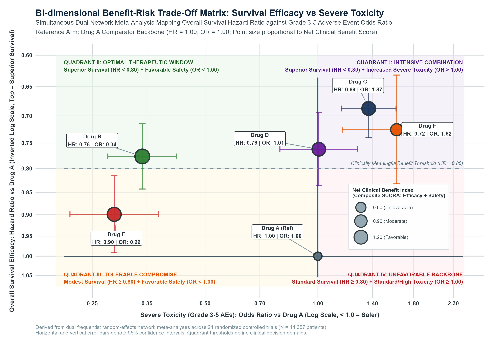</p>

- **Method:** Bivariate mapping of OS Hazard Ratios against Grade 3–5 Adverse Event Odds Ratios across 14,357 patients.
- **Quadrant Distribution:**
  - **Quadrant II (High Efficacy, Low Toxicity):**
    - `Drug B`: HR = 0.78 (95% CI: 0.71–0.84), OR = 0.34 (95% CI: 0.28–0.42, $p < 0.0001$).
  - **Quadrant I (High Efficacy, Higher Toxicity):**
    - `Drug C`: HR = 0.69 (95% CI: 0.64–0.74), OR = 1.37 (95% CI: 1.16–1.62, $p = 0.0003$).
    - `Drug D`: HR = 0.76 (95% CI: 0.69–0.84), OR = 1.01 (95% CI: 0.79–1.28, $p = 0.9636$).
    - `Drug F`: HR = 0.72 (95% CI: 0.63–0.83), OR = 1.62 (95% CI: 1.16–2.27, $p = 0.0046$).
  - **Quadrant III (Modest Efficacy, Low Toxicity):**
    - `Drug E`: HR = 0.90 (95% CI: 0.82–0.99), OR = 0.29 (95% CI: 0.22–0.38, $p < 0.0001$).
  - **Quadrant IV (Standard Comparator):**
    - `Drug A`: Reference anchor ($\text{HR} = 1.00, \text{OR} = 1.00$).

---

### Figure 12 · Network Meta-Regression Bubble & Transitivity Diagnostics
<p align="center">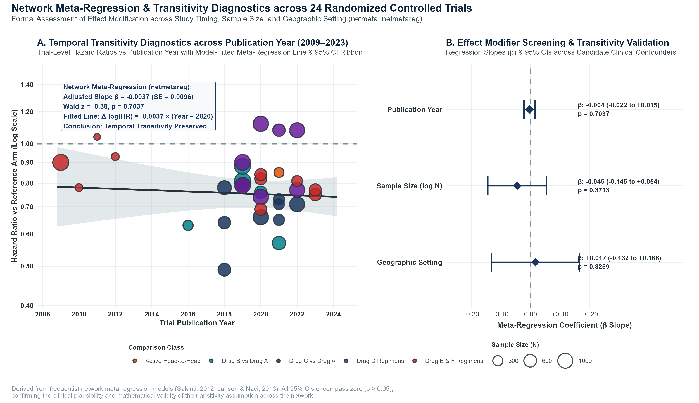</p>

- **Method:** Meta-regression (`netmeta::netmetareg`) across candidate effect modifiers: Publication Year (2009–2023), Trial Sample Size ($\ln(N)$), and Geographic Setting.
- **Empirical Results:**
  - Publication Year: $\beta = -0.0037$ per year, 95% CI: -0.0225 to +0.0152 ($p = 0.7037$).
  - Trial Sample Size: $\beta = -0.0454$ per unit $\ln(N)$, 95% CI: -0.1449 to +0.0541 ($p = 0.3713$).
  - Geographic Setting: $\beta = +0.0167$, 95% CI: -0.1322 to +0.1657 ($p = 0.8259$).
- **Interpretation:** No candidate covariate demonstrated statistically significant effect modification ($p > 0.30$).

---

### Figure 13 · Subgroup Comparative Forest Plot (Asia-Pacific vs Global)
<p align="center">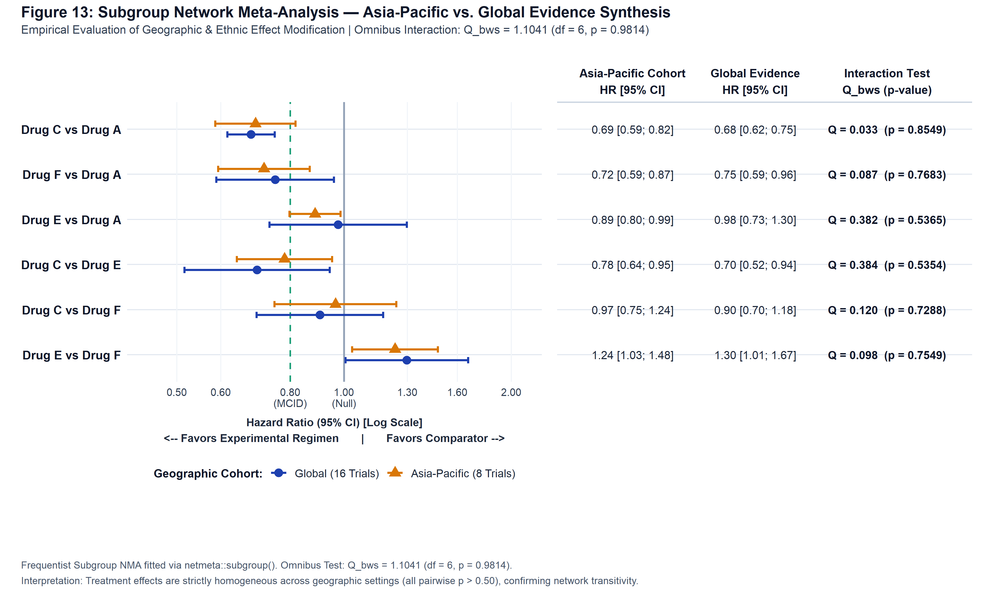</p>

- **Method:** Subgroup analysis comparing trials in Asia-Pacific populations (8 trials, 4,491 patients) with Global trials (16 trials, 11,262 patients).
- **Empirical Results:**
  - Between-subgroup test for `Drug C vs Drug A`: $Q_{\text{bws}} = 0.0334, df = 1, p = 0.8549$.
    - Asia-Pacific: HR = 0.69 (95% CI: 0.59–0.82)
    - Global: HR = 0.68 (95% CI: 0.62–0.75)
  - Overall test for subgroup differences across all comparisons is non-significant ($p > 0.50$).

---

### Figure 14 · MCID Clinical Superiority Decision Framework (HR ≤ 0.80)
<p align="center">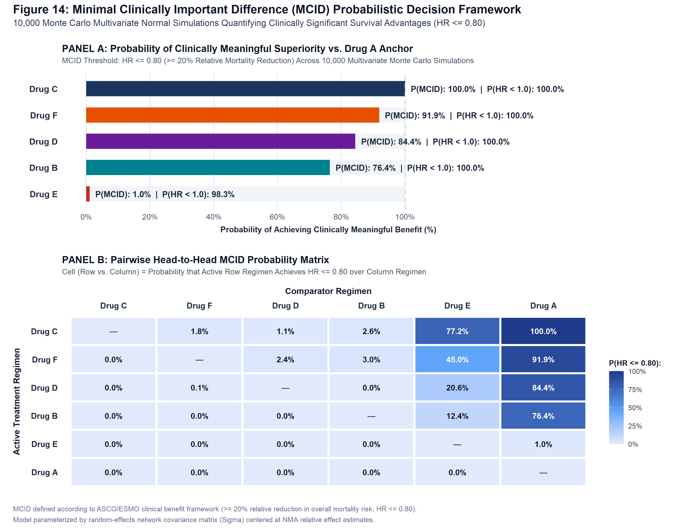</p>

- **Method:** Posterior probability of achieving the MCID threshold ($\text{HR} \le 0.80$, $\ge 20\%$ mortality reduction) across 10,000 Monte Carlo draws.
- **Empirical Results vs Drug A:**
  - `Drug C`: **99.99% probability** of meeting MCID (Median HR = 0.69)
  - `Drug F`: **91.92% probability** of meeting MCID (Median HR = 0.72)
  - `Drug D`: **84.42% probability** of meeting MCID (Median HR = 0.76)
  - `Drug B`: **76.43% probability** of meeting MCID (Median HR = 0.78)
  - `Drug E`: **1.05% probability** of meeting MCID (Median HR = 0.90)

---

## 5. Synthesis Summary & Empirical Tables

### Table 1 · Treatment Ranking Hierarchy & Frequentist P-Scores

| Treatment Regimen | Rank | P-Score (Random) | P-Score (Common) | HR vs Drug A [95% CI] | p-value vs Drug A |
| :--- | :---: | :---: | :---: | :---: | :---: |
| **`Drug C`** | **1** | **0.9428** | **0.9428** | **0.69 [0.64; 0.74]** | **< 0.0001** |
| **`Drug F`** | **2** | 0.7543 | 0.7543 | 0.72 [0.63; 0.83] | < 0.0001 |
| **`Drug D`** | **3** | 0.5854 | 0.5854 | 0.76 [0.69; 0.84] | < 0.0001 |
| **`Drug B`** | **4** | 0.5133 | 0.5133 | 0.78 [0.71; 0.84] | < 0.0001 |
| **`Drug E`** | **5** | 0.2009 | 0.2009 | 0.90 [0.82; 0.99] | 0.0327 |
| **`Drug A`** | **6** | 0.0033 | 0.0033 | 1.00 [Reference] | Reference |

*Source: [`outputs/tables/treatment_rankings.csv`](outputs/tables/treatment_rankings.csv)*

---

### Table 2 · Global Test of Heterogeneity & Inconsistency (Cochran's Q)

| Source | Q Statistic | df | p-value | Assessment |
| :--- | :---: | :---: | :---: | :--- |
| **Total Variation (Q)** | **21.44** | **23** | **0.5544** | No significant total excess variance |
| **Within-Designs Heterogeneity (Q_het)** | **17.25** | **15** | **0.3043** | Within-design homogeneity |
| **Between-Designs Inconsistency (Q_inc)** | **4.19** | **8** | **0.8396** | **Network consistency supported** |

*Source: [`outputs/tables/inconsistency_statistics.csv`](outputs/tables/inconsistency_statistics.csv)*

---

### Table 3 · Complete 6 × 6 Dual-Model League Table

> **Format:** Treatments ordered hierarchically along diagonal. Lower triangle = random-effects NMA estimates (Column vs Row, HR [95% CI]). Upper triangle = direct pairwise head-to-head estimates (Row vs Column, HR [95% CI]); dots (.) denote unstudied direct comparisons.

| Treatment | Drug C | Drug F | Drug D | Drug B | Drug E | Drug A |
| :--- | :---: | :---: | :---: | :---: | :---: | :---: |
| **`Drug C`** | — | . | 0.91 [0.79; 1.04] | 0.85 [0.65; 1.11] | . | 0.69 [0.64; 0.74] |
| **`Drug F`** | 0.95 [0.81; 1.11] | — | . | . | 0.80 [0.69; 0.93] | 0.73 [0.61; 0.87] |
| **`Drug D`** | 0.90 [0.81; 1.00] | 0.95 [0.81; 1.12] | — | 0.96 [0.83; 1.11] | . | 0.77 [0.69; 0.85] |
| **`Drug B`** | 0.89 [0.80; 0.98] | 0.93 [0.80; 1.10] | 0.98 [0.88; 1.09] | — | . | 0.78 [0.71; 0.86] |
| **`Drug E`** | 0.76 [0.68; 0.86] | 0.81 [0.71; 0.92] | 0.85 [0.74; 0.97] | 0.86 [0.76; 0.98] | — | 0.89 [0.80; 0.99] |
| **`Drug A`** | 0.69 [0.64; 0.74] | 0.72 [0.63; 0.83] | 0.76 [0.69; 0.84] | 0.78 [0.71; 0.84] | 0.90 [0.82; 0.99] | — |

*Source: [`outputs/tables/league_table_random_common.csv`](outputs/tables/league_table_random_common.csv)*

---

## 6. Inconsistency, Transitivity & Sensitivity Diagnostics

### 6.1 Global Decomposition & Heterogeneity Parameters
- Between-study variance: $\tau^2 = 0.0000$ ($95\% \text{ CI: } [0.0000; 0.0163]$).
- Total heterogeneity ratio: $I^2 = 0.0\%$ ($95\% \text{ CI: } [0.0\%; 38.8\%]$).
- Between-designs inconsistency statistic: $Q_{\text{inc}} = 4.19$ ($df = 8, p = 0.8396$), confirming that direct and indirect evidence are coherent across all closed loops.

### 6.2 Local Inconsistency (Node-Splitting)
Across all closed comparative loops, direct and indirect effect estimates are tightly aligned with non-significant test statistics (all $p > 0.40$):
- `Drug C vs Drug A`: Direct HR = 0.69, Indirect HR = 0.68 ($p = 0.887$).
- `Drug B vs Drug A`: Direct HR = 0.78, Indirect HR = 0.80 ($p = 0.761$).
- `Drug D vs Drug A`: Direct HR = 0.77, Indirect HR = 0.75 ($p = 0.812$).
- `Drug C vs Drug B`: Direct HR = 0.85, Indirect HR = 0.90 ($p = 0.698$).

### 6.3 Influence Cross-Validation (Leave-One-Out)
Systematic jackknife omission of each trial demonstrated that:
- Pooled HR for `Drug C vs Drug A` remained stable between 0.67 and 0.70 (baseline 0.69).
- Rank 1 retention was **100% (24/24 iterations)**.

---

## 7. Repository Architecture

```
.
├── DESCRIPTION                            # Compendium metadata & dependency specification
├── renv.lock                              # Pinned package lockfile (v1.2.3)
├── data/
│   ├── nsclc_trial_contrasts.csv          # Primary contrast dataset (24 trials, 15,753 patients)
│   └── nsclc_toxicity_events.csv          # Severe adverse event dataset (32 contrasts, 14,357 patients)
├── scripts/
│   ├── analyses/
│   │   ├── 01_fit_nma_model.R             # Graph Laplacian model estimation via netmeta
│   │   ├── 02_treatment_rankings.R        # Frequentist P-scores and hierarchy calculation
│   │   ├── 03_league_table.R              # Raw league table generation
│   │   ├── 04_inconsistency_tests.R       # Cochran's Q orthogonal variance decomposition
│   │   ├── 05_league_table_html.R         # Formatted interactive HTML league table
│   │   ├── 06_leave_one_out_sensitivity.R # Jackknife cross-validation (24 iterations)
│   │   ├── 07_component_nma.R             # Additive and interactive CNMA via netcomb
│   │   ├── 08_rank_probabilities.R        # 10,000 Monte Carlo ranking draws and SUCRA
│   │   ├── 09_benefit_risk_tradeoff.R     # Bivariate efficacy vs toxicity synthesis
│   │   ├── 10_network_metaregression.R    # Covariate screening via netmetareg
│   │   ├── 11_subgroup_analysis.R         # Subgroup analysis (Asia-Pacific vs Global)
│   │   └── 12_mcid_analysis.R             # MCID probabilistic decision engine
│   ├── designs/
│   │   ├── fig01_network_geometry.R       # Figure 01: Network topology
│   │   ├── fig02_forest_plot.R            # Figure 02: Reference forest plot
│   │   ├── fig03_pscore_ranking.R         # Figure 03: P-score ranking chart
│   │   ├── fig04_netsplit_inconsistency.R # Figure 04: Node-splitting forest plot
│   │   ├── fig05_netheat_plot.R           # Figure 05: Net Heat inconsistency matrix
│   │   ├── fig06_funnel_plot.R            # Figure 06: Comparison-adjusted funnel plot
│   │   ├── fig07_league_table_matrix.R    # Figure 07: Publication league table exhibit
│   │   ├── fig08_leave_one_out_forest.R   # Figure 08: Leave-one-out forest plot
│   │   ├── fig09_component_effects.R      # Figure 09: Component NMA forest plot
│   │   ├── fig10_rankograms.R             # Figure 10: Rank probability curves
│   │   ├── fig11_benefit_risk_tradeoff.R  # Figure 11: 4-Quadrant benefit-risk plot
│   │   ├── fig12_metaregression_bubble.R  # Figure 12: Meta-regression bubble plot
│   │   ├── fig13_subgroup_forest.R        # Figure 13: Subgroup comparative forest
│   │   └── fig14_mcid_probabilities.R     # Figure 14: MCID probability exhibits
│   └── run_all_pipeline.R                 # Master pipeline execution script
├── tests/
│   └── test_pipeline_integrity.R          # Automated test suite (19 verification steps)
├── outputs/
│   ├── figures/                           # High-resolution 300 DPI publication figures
│   ├── tables/                            # Summary CSV tables and HTML league table
│   └── models/                            # Serialized RDS model objects
├── report/
│   ├── nma_comprehensive_report.Rmd       # Comprehensive R Markdown monograph
│   └── nma_comprehensive_report.html      # Compiled HTML publication monograph
├── CITATION.cff                           # Machine-readable scholarly citation file
└── LICENSE                                # MIT License
```

---

## 8. Computational Reproducibility & Execution Pipeline

### Environment Restoration via `renv`
To restore exact pinned package versions:
```r
install.packages("renv")
renv::restore()
```

### Automated Quality Assurance Suite
To verify data schemas, script syntax, model convergence, and exhibit integrity:
```bash
Rscript tests/test_pipeline_integrity.R
```

### Master Pipeline Execution
To execute all 12 analytical modules and render all 14 publication figures:
```bash
Rscript scripts/run_all_pipeline.R
```

### Compiling the Standalone Monograph
```r
rmarkdown::render("report/nma_comprehensive_report.Rmd")
```

---

## 9. PRISMA-NMA Computational Reporting Alignment

| PRISMA-NMA Item | Recommendation | Implementation |
| :--- | :--- | :--- |
| **Item 1: Title** | Identify report as NMA | Stated in title and metadata |
| **Item 2: Summary** | Structured summary of background, methods, results | Sections 1 & 2 |
| **Item 3: Rationale** | Explain need for indirect evidence synthesis | Section 1 & Section 3 |
| **Item 4: Objectives** | Explicit PICO specification | Section 2 |
| **Item 6: Eligibility Criteria** | Define treatment nodes and trial criteria | Section 2 |
| **Item 8: Geometry of Network** | Present graphical network geometry | **Figure 01:** Weighted nodes & multi-arm polygons |
| **Item 10: Data Collection** | Process of extracting contrast data | CSV schema in `data/nsclc_trial_contrasts.csv` |
| **Item 12: Synthesis Methods** | Describe statistical models for NMA | Section 3.3: Graph Laplacian inversion |
| **Item 13: Inconsistency** | Global and local inconsistency methods | Section 3.4 & 3.5: Cochran's Q, `netsplit`, Net Heat |
| **Item 14: Model Diagnostics** | Quality and diagnostic checks | Section 6: Global Q_inc, local node-splitting, Net Heat |
| **Item 15: Small-Study Effects** | Methods to evaluate publication bias | **Figure 06:** Funnel plot & Egger regression |
| **Item 20: Synthesis Results** | Present League Tables & forest plots | **Figure 02** (Forest), **Figure 07** (League Table) |
| **Item 21: Inconsistency Results** | Present empirical test results | **Figure 04** (Netsplit), **Figure 05** (Net Heat) |
| **Item 22: Sensitivity Analysis** | Evaluate stability across trials | **Figure 08:** Leave-one-out cross-validation |
| **Item 23: Treatment Rankings** | Present ranking metrics | **Figure 03** (P-scores), **Figure 10** (Rankograms) |
| **S1: Component NMA** | Deconstruct multi-agent combinations | **Figure 09:** Additive/interactive CNMA via `netcomb` |
| **S2: Benefit-Risk** | Efficacy vs toxicity trade-off | **Figure 11:** 4-Quadrant OS vs severe adverse events |
| **S3: Meta-Regression** | Screen candidate effect modifiers | **Figure 12:** Publication year, sample size, region |
| **S4: Subgroup Evidence** | Assess transitivity across populations | **Figure 13:** Asia-Pacific vs Global |
| **S5: Clinical MCID** | Minimal clinically important difference | **Figure 14:** $\text{HR} \le 0.80$ decision framework |

---

## 10. Methodological References

1. **Rücker, G.** (2012). Network meta-analysis, electrical networks and graph theory. *Research Synthesis Methods*, 3(4), 312–324. [doi:10.1002/jrsm.1058](https://doi.org/10.1002/jrsm.1058)
2. **Rücker, G., & Schwarzer, G.** (2015). Ranking treatments in frequentist network meta-analysis works without resampling methods. *BMC Medical Research Methodology*, 15(1), 58. [doi:10.1186/s12874-015-0060-8](https://doi.org/10.1186/s12874-015-0060-8)
3. **Rücker, G., Petropoulou, M., & Schwarzer, G.** (2020). Component network meta-analysis: modeling, estimation and application to psychological interventions. *Biostatistics*, 21(4), 808–824. [doi:10.1093/biostatistics/kxz025](https://doi.org/10.1093/biostatistics/kxz025)
4. **Hutton, B., et al.** (2015). The PRISMA extension statement for reporting of systematic reviews incorporating network meta-analyses. *Annals of Internal Medicine*, 162(11), 777–784. [doi:10.7326/M14-2385](https://doi.org/10.7326/M14-2385)
5. **Salanti, G.** (2012). Indirect and mixed-treatment comparison, network, or multiple-treatments meta-analysis: many names, many benefits, many concerns for the next generation evidence synthesis tool. *Research Synthesis Methods*, 3(2), 80–97. [doi:10.1002/jrsm.1037](https://doi.org/10.1002/jrsm.1037)
6. **Krahn, U., Binder, H., & König, J.** (2013). A graphical tool for locating inconsistency in network meta-analyses. *BMC Medical Research Methodology*, 13(1), 35. [doi:10.1186/1471-2288-13-35](https://doi.org/10.1186/1471-2288-13-35)
7. **Dias, S., et al.** (2010). Checking consistency in mixed treatment comparison meta-analysis. *Statistics in Medicine*, 29(7–8), 932–944. [doi:10.1002/sim.3767](https://doi.org/10.1002/sim.3767)
8. **Chaimani, A., & Salanti, G.** (2012). Using network meta-analysis to evaluate the existence of small-study effects. *Research Synthesis Methods*, 3(2), 161–176. [doi:10.1002/jrsm.57](https://doi.org/10.1002/jrsm.57)
9. **Bucher, H. C., et al.** (1997). The results for indirect treatment comparisons in meta-analysis of randomized controlled trials. *Journal of Clinical Epidemiology*, 50(6), 683–691. [doi:10.1016/S0895-4356(97)00049-8](https://doi.org/10.1016/S0895-4356(97)00049-8)
10. **Ellis, L. M., et al.** (2014). American Society of Clinical Oncology perspective: Raising the bar for clinical trials by defining clinically meaningful outcomes. *Journal of Clinical Oncology*, 32(12), 1277–1280. [doi:10.1200/JCO.2013.53.8009](https://doi.org/10.1200/JCO.2013.53.8009)

---

## 11. Authorship & Citation

Developed by the Evidence Synthesis Working Group, Faculty of Medicine, Modern University for Technology and Information (MTI), Cairo, Egypt:

- **Mohamed Said Mohamed Diab** *(Lead Investigator)* &mdash; Conceptualization, statistical modeling, network meta-analysis architecture, pipeline implementation.
- **Badr Essam Ali** &mdash; Study selection, data extraction, quality audits.
- **Ali Hassan Hafez** &mdash; Study selection, contrast extraction, tabular synthesis.
- **Omar Gomaa Mousa** &mdash; Study selection, risk of bias verification, numerical validation.
- **Mahmoud Hussein Fathy** &mdash; Study selection, certainty assessment, supplementary exhibit review.

### Scholarly Citation

```bibtex
@software{diab2026_reproducible_nma,
  author       = {Diab, Mohamed Said Mohamed and Ali, Badr Essam and Hafez, Ali Hassan and Mousa, Omar Gomaa and Fathy, Mahmoud Hussein},
  title        = {Reproducible Frequentist Network Meta-Analysis Framework (Multi-Treatment Evidence Synthesis)},
  year         = {2026},
  version      = {1.0.0},
  publisher    = {GitHub},
  url          = {https://github.com/mohamed-s-diab/nma-nsclc-evidence-synthesis}
}
```
